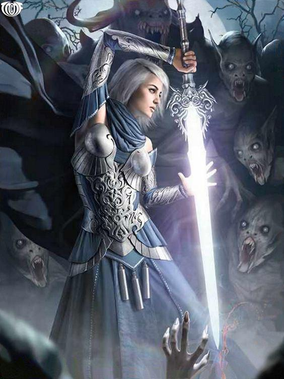

## در اینجا عکسی از هر تکلیف ( آن هایی که عکس داشتند ) و کد های ان ها را می بینیم . روی هر عکس بزنید کد مربوط به آن باز می شود . ان شا الله که بشود 
<a href= "C:\git\personal_website_template\s7.py"> <image src="C:\git\personal_website_template\assets\images\screenshot(104).png"> <a>

<iframe src="https://calendar.google.com/calendar/embed?src=mirzakhani94%40gmail.com&ctz=Asia%2FTehran" style="border: 0" width="800" height="600" frameborder="0" scrolling="no"></iframe>

<a href= "C:\git\personal_website_template\taklif.py"> تکلیف جلسه دو بود  <a>

<a href= "C:\git\personal_website_template\s3.py"> تکلیف جلسه دو بود  <a>

[تکلیف جلسه 3][def C:\git\personal_website_template\s3.py]

[وبسایت بوک پایونیر که بعد از انحلال بوک پیج به انتشار این رمان ادامه میدهد. ](https://bookpioneers.ir)

---
**Test**: This is atest

[def]: ../../FC02031/FC02031/s/s3/s3.py